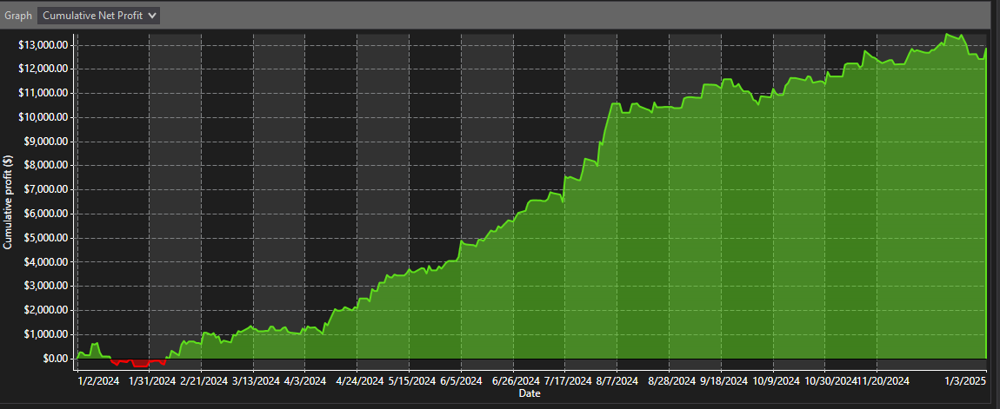
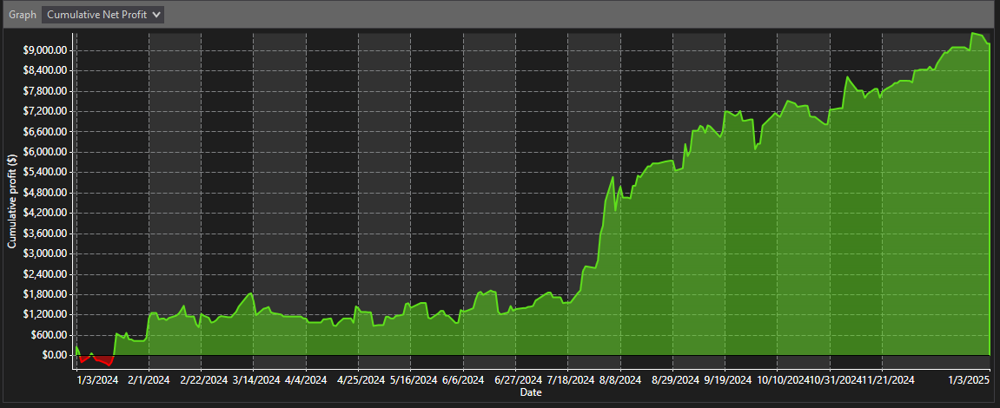
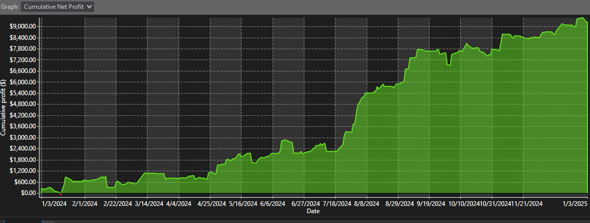

# Intro

This repo is for any and all free strategies I develop and optimize. I have extra bots I’ve made over my time developing, and I do not use them all, so I thought I would give back to the trading community by providing something that someone finds useful.

These are all backtested, but they do NOT guarantee that they will perform like this in the future. All the strategies will be backtested from 1/1/2024 to the current date in the time frames 15 min, 30 min, and 60 min on MNQ Indices. If abnormally great results are found in lower time frames, they will be provided. (Not including lower time frames DOES NOT MEAN GOOD RESULTS DON'T EXIST THERE.) If the backtest date were to change, I will make a note. I will be constantly updating this repo with more strategies I deprecate (just don't use anymore because I found something better), which does not mean these strategies are entirely useless—they are just old code collecting dust.

All these bots/strats/algos are developed in C# for Ninja Trader. I provided the source code in the repo if you like the results enough to convert to the language of your choosing. 

# Stratigies/Bots/Algorithms:
- TrendAholic (Uploaded 1/6/25)

## TrendAholic
### 15 Min

[Template File Here](./templates/MaxBots.TrendAholic/15Min.xml)

### 30 Min

[Template File Here](./templates/MaxBots.TrendAholic/30Min.xml)

### 60 Min

[Template File Here](./templates/MaxBots.TrendAholic/60Min.xml)